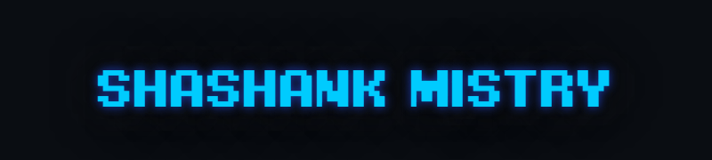

<div style="display:flex;">

</div>


```
import com.developer.shashank;

public class GitHubActivity extends AppCompatActivity implements shashank.OnReadMeListener {

protected void onCreate(Bundle savedInstanceState) {
    String name = "Shashank Mistry";
    String title = "Android Developer";
    String location = "Anand, Gujarat";
    
    skills();
  }
  
  private void skills() {
    String[] languages = {"C","JAVA","PYTHON","HTML","CSS"};
    String[] databases = {"MySQL","SQlite","NoSQL"};
    String[] tools = {"Android Studio","VSCode","Sublime"};
  }

   @override
   public void onReadMeListener(R -> {
      Toast.makeText(GitHubActivity.this,"Thanks for visiting my github",Toast.LENGTH_LONG).show();
   }
}
```


<!--
**ShashankMistry/ShashankMistry** is a ✨ _special_ ✨ repository because its `README.md` (this file) appears on your GitHub profile.

Here are some ideas to get you started:

- 🔭 I’m currently working on ...
- 🌱 I’m currently learning ...
- 👯 I’m looking to collaborate on ...
- 🤔 I’m looking for help with ...
- 💬 Ask me about ...
- 📫 How to reach me: ...
- 😄 Pronouns: ...
- ⚡ Fun fact: ...
-->
